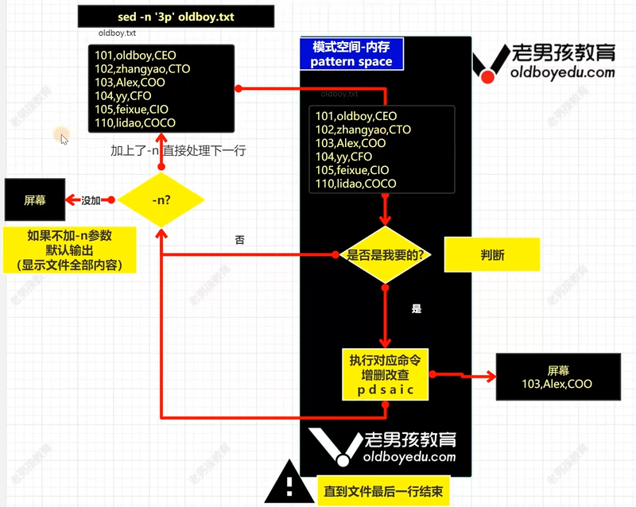

# Shell基础

# 代码规范：
#!/bin/bash，用于指定当前脚本要使用的Shell解释器
Shell相关命令

## 文件命名规范
文件名.sh，.sh是bash shell的默认后缀

## 使用流程
- 创建```.sh文件     touch/vim```
- 编写shell代码
- 执行shell脚本   脚本必须要有执行权限

## 执行脚本
- 使用```./文件名.sh```或者```绝对路径 文件名.sh```，需要脚本有执行权限，一般是系统脚本
- ```/bin/bash 文件名.sh```
- ```sh 文件名.sh```
- ```source 文件名.sh```和```. 文件名.sh```，让环境变量生效；类似于include功能，把放在其他位置的配置文件包含进主配置文件中

# 变量
先定义后使用
不能以数字开头

## 环境变量
### env

### declare

### export 环境变量名
环境变量（名）可自定义

### unset 环境变量名
取消环境变量

如果要永久修改环境变量，要在```/etc/profile/```中修改

### LANG：记录系统字符集语言
### PS1：命令行格式
### PATH：命令路径
### UID：记录用户的UID信息
### HOSTNAME：主机名
### HISTSIZE：history命令记录的条数（最多），
```history -c/-w/-a/-d```
### HISTFILESIZE：history文件记录的最多条数，默认在~/.bash_history
### HISTFILE：指定历史文件记录的位置
### TMOUT：不进行操作自动断开的时间，```export TMOUT=num```
### HISTCONTROL：控制history命令是否记录以空格开头的命令，```export HISTCONTROL=ignorespace```以空格开头的命令不会被记录到history
### PROMPT_COMMAND：存放的命令/脚本会在下一个命令执行前运行

### 相关文件目录
- /etc/profile：存放环境变量，别名
- /etc/bashrc：别名
- ~/.bashrc：当前用户的别名
- ~/，bash_profile：当前用户的环境变量
- /etc/profile.d/xxxx.sh：用户登录系统后，执行这个目录下以.sh结尾的脚本

## 特殊变量
### 位置
#### $0
脚本的名字
一般在脚本执行出错时，显示错误提示

#### $n
n是数字，脚本的第几个参数
可将命令行的内容通过$n传递到脚本中
{0..12}，表示1到12

#### $#
脚本参数的个数一共有多少个参数

#### $*
取出所有的参数，加上双引号，是一个整体，一个参数

#### $@
取出所有的参数，加上双引号，每个都是独立的

### 状态
#### $?
查看上一条命令或者脚本的返回值，判断执行/服务是否成功
0正常；非0失败

#### \$$
查看当前运行脚本的pid

#### $!
查看上一个运行的脚本的pid

#### $_
查看上一个脚本或命令的最后一个参数

###  变量子串
#### ${变量}
返回变量的内容

#### ${#变量}
返回变量$parameter的长度

#### ${parameter:offset}
在$parameter中，从位置offset之后开始提取子串
offset，数字，表示从第几个字母或符号开始，从0开始

#### ${parameter:offset:length}
在$parameter中，从位置offset之后开始提取长度为length的子串

#### ${parameter#word}
从变量$parameter的开头删除最短匹配word的子串

#### ${parameter##word}
从变量$parameter的开头删除最长匹配word的子串

#### ${parameter%word}
从变量$parameter的结尾删除最短匹配word的子串

#### ${parameterword}
从变量$parameter的结尾删除最长匹配word的子串

#### ${parameter/pattern/string}
使用string来代替第一个匹配的pattern

#### ${parameter//pattern/string}
使用string代替所有匹配的pattern

### 变量扩展
给变量设置默认值
#### ${paremeter:-word}
如果变量没有被赋值或者值为空，那么就以word作为其值

#### ${parameter:=word}
如果变量没有被赋值或者值为空，那么就以word作为其值，并将word赋值给变量

#### ${parameter:?word}
如果变量没有被赋值或者值为空，那么就把word作为错误输出，否则显示变量内容

#### ${parameter:+word}
如果变量没有被赋值或者值为空，就什么都不做，否则用word替换变量内容

## 普通变量
week=3
今天是第${week}day

#### class_name="yunwei"
定义变量class_name，值为yunwei

#### echo $class_name
使用echo执行变量，变量前需加$

#### ' '
单引号，不能识别变量，不能实现转义

#### " "
双引号，可以识别变量，可以实现转义

#### *
默认是通配符，\*表示乘号，这个过程叫做转义

#### `
反引号，当在脚本中要执行一些指令并将执行结果赋值给变量时需要使用反引号包住

#### readonly 变量名
只读变量，只能读，不能修改

#### read -p 提示信息 变量名
- -p，输出提示信息
- -s，可选，隐藏输入信息
- -t 5，限时5秒输入，5秒后结束命令
接收用户输入

#### unset 变量名
删除变量

#### ./test.sh a b c
传递选项
使用$1 $2 $3来接收


# 运算
## 运算符号
- \+ - * / %
- &&，并，前一个命令执行成功再执行后面的命令
- ||，或，前一个命令执行失败再执行后面的命令
- i++ == i=i+i
- a+=2 <--> a=a+2
- a=a+1 <--> a++
- $((a=1+2))，双括号表示直接运算，但不支持小数运算

### $((RANDOM%10))
生成0-32767的随机数，再对10取余，生成0-9的随机数

### let c=1+2
用于运算后直接赋值

### expr 1 \* 2
用于运算，注意空格
- expr $?，可以用来判断运算的是不是数字

### echo 9/6 |bc -l
基础运算，可计算小数
- echo "obase=进制;数字"|bc -l，用来将十进制数转换为对应进制

### awk -vn1=1 -vn2=3 'BEGIN{print n1/n2}'
- -v，修改awk的变量，和后面变量可不加空格


# 运算符
## 算术运算符
a=10，b=20
### +
加法，```expr $a + $b```结果为30

### -
减法，```expr $a - $b```结果为-10

### *
乘法，```expr $a * $b```结果为200

### /
除法，```expr $b / $a```结果为2

### %
取余，```expr $b % $a```结果为0

### =
赋值，```a=$b```把b的值赋给a

### ==
相等，```[ $a == $b ]```返回false

### !=
不相等，```[ $a != $b ]```返回ture

## 关系运算符
a=10，b=20
### -eq
检测两个数是否相等，相等返回true
```[ $a -eq $b ]false```

### -ne
检测两个数是否相等，不相等返回true
```[ $a -ne $b ]false```

### -gt
检测左边的数是否大于右边，如果是，返回true
```[ $a -gt $b ]false```

### -lt
检测左边的数是否小于右边，如果是，返回true
```[ $a -lt $b ]``` ```true```

### -ge
检测左边的数是否大于等于右边，如果是，返回true
```[ $a -ge $b ]``` ```false```

### -le
检测左边的数是否小于等于右边，如果是，返回true
```[ $a -le $b ]``` ```ture```

## 逻辑运算符
a=10，b=20
### !
非运算，表达式为true则返回false，否则返回true
```[ !false ]``` ```true```

### o
或运算，有一个表达式为true则返回true
```[ $a -lt 20 -o $b -gt 100 ]``` ```true```

### -a
与运算，两个表达式都为true才返回true
```[ $a -lt 20 -a $b -gt 100 ]``` ```false```

## 字符串运算符
a为"abc"，b为"efg"
### =
检测两个字符串是否相等，相等返回true
```[ $a = $b ]``` ```false```

### !=
检测两个字符串是否相等，不相等返回true
```[ $a != $b ]``` ```true```

### -z
检测字符串长度是否为0，为0返回true
```[ -z $a ]``` ```false```

### -n
检测字符串长度是否为0，不为0返回true
```[ -n $a ]``` ```true```

### str
检测字符串是否为空，不为空返回true
```[ $a ]``` ```true```

## 文件测试运算符
用于检测Unix/Linux文件的各种属性
### -d file
检测文件是否是目录，如果是，返回true
```[ -d $file ]``` ```false```

### -f file
检测文件是否是普通文件，如果是，返回true
```[ -f $file ]``` ```true```

### -r file
检测文件是否可读，如果是，返回true
```[ -r $file ]``` ```true```

### -w file
检测文件是否可写，如果是，返回true
```[ -w $file ]``` ```true```

### -x file
检测文件是否可执行，如果是，返回true
```[ -x $file ]``` ```true```

### -s file
检测文件是否为空（文件大小是否大于0），不为空返回true
```[ -s $file ]``` ```frue```

### -e file
检测文件或目录是否存在，如果是，返回true
```[ -e $file ]``` ```true```


# 条件测试语句
- test 条件
- \[条件]
- \[\[条件]]
- ((条件))
- \[ -f /etc/hostname ]

## 文件
### -d
目录是否存在

### -f
文件是否存在

### -e
是否存在

### -r/w/x
是否可读/可写/可执行

### -s
文件是否为空，大小是否为0

## 字符串
加上双引号
### -n
如果变量或字符串不是空则成立

### -z
如果变量或字符串是空则成立

### "str1" = "str2"
判断两个字符串/变量内容是否一致，如果相等则成立

### "str1" != "str2"
判断两个字符串/变量内容是否一致，如果不相等则成立


# 条件判断语句
## if语句
```bash
if condition;then
    command1
    command2
    ...
fi
```

```bash
if \[ condition ]; then command; fi
```
一般在命令行中执行时使用

```bash
if condition
  then
    command1
    command2
    ...
  else
    command
fi
```
```bash
if condition1
  then
    command1

  elif condition2
  then
    command2

  else
    commandN
fi
```

## case语句
```bash
case $变量 in
"值1")
    如果变量的值等于值1,则执行程序1
;;
"值2")
    如果变量的值等于值2,则执行程序2
;;
    ...
)
    如果变量的值都不是以上的值，则执行此程序
;;
esac
```

# 循环
## 6.1 for循环

```bash
for (( 初始值;循环控制条件;变量变化 ))
do
	程序
done
```

```bash
for 变量 in 值1 值2 值3 ... 
do
      程序
done
```

## while循环
```bash
while [ 条件判断式 ]
  do
      程序
done
```

# 函数
## 系统函数
### basename
```basename [ string/pathname ] [ suffix ]```

删掉所有的前缀包括最后一个（'/'）字符，然后将字符串显示出来
```bash
wasd@Dell:~$ basename /home/wasd/Documents/linux-practice/shell-test/test2.sh
test2.sh
wasd@Dell:~$ basename /home/wasd/Documents/linux-practice/shell-test/test2.sh .sh
test2
```

### dirname
```dirname 文件绝对路径```

在给定的包含绝对路径的文件名中去除文件名（非目录的部分），返回剩下的路径
```bash
wasd@Dell:~$ dirname /home/wasd/Documents/linux-practice/shell-test/test2.sh
/home/wasd/Documents/linux-practice/shell-test
```

## 自定义函数
```bash
[ function ] funname[()]  # 声明函数
{
  Action;
  [return int;]
}                         # []包裹的内容可省略
```

# 正则
regular expression (RE)

支持：三剑客，find，rename（Ubuntu），expr
## 注意事项
- 所有符号都是英文符号
- grep加上单引号
- 注意系统的字符集:en_US.UTF-8，如果出现问题修改字符集为1C```export LANG=C```
- 配合grep -o

## 符号
|   分类   |       |       |       |       |       |       |       |        |       命令       |
| :------: | :---: | :---: | :---: | :---: | :---: | :---: | :---: | :----: | :--------------: |
| 基础正则 |   ^   |   $   |  ^$   |   .   |   *   |  .*   | [a-z] | [^abc] |   grep/sed/awk   |
| 扩展正则 |   +   |  \|   |  ()   |  {}   |   ?   |       |       |        | egrep/sed -r/awk |

## 基础正则
### ^
- ^oldboy，筛选以oldboy开头的行
```bash:
wasd@Dell:~$ grep '^a' test.txt 
a 
ask 
and 
and 
and 
anxious 
and 
afternoons . 
are 
address 
and 
```

### $
- '$olgboy，筛选以oldboy结尾
```bash
wasd@Dell:~$ grep 'e $' test.txt 
Chinese 
course 
came 
here 
have 
some 
have 
use 
the 
the 
have 
Please 
me 
phone 
Here 
are 
phone 
```
- cat -A，显示所有隐藏的符号

### ^$
- '^$'，筛选空行（空格也是符号）
- -n，显示行数
- -v，排除空行
```bash
wasd@Dell:~$ grep ' ' test.txt 
hua@1236.com ; 1234567.
Look forward to your reply .
Yours ,
Li Hua
```
```bash
wasd@Dell:~$ grep -n '^$' test.txt 
2:
100:
102:
104:
```
### .
- grep '.' test.txt
- 匹配任意字符
- 不匹配空行
```bash
wasd@Dell:~$ grep '.' test.txt 
Dear Sir ,
I’m LiHua , 
university . 
help . 
interesting .
library . 
you. 
I  have no class on Tuesdays mornings and Friday afternoons . Please let me 
know which day is ok with you. 
number :
lihua@1236.com ; 1234567.
Look forward to your reply .
Yours ,
Li Hua
```

### \
- 转义字符
- \n，回车
- \t，tab

### *
- grep 't*' test.txt
- 前一个字符重复出现了0次或0次以上
- 0，出现一次
- 000，出现三次
- oldboy，小写字母连续出现六次

### .*
- 筛选所有内容
- grep '^.*t' test.txt，匹配所有从开头开始以t结尾的内容（一行中最后的t）

### [] [abc]
- 一次匹配一个字符，匹配任何一个字符（a或b或c）
- grep '[abc]' test.txt
- grep -o '[abc]' test.txt，显示grep的匹配过程
- grep -i '[a-z0-9]' test.txt，匹配字母和数字，-i不区分大小写
- [a-z]，匹配所有小写字母
- [A-Z]，匹配所有大写字母
- [a-Z]，匹配所有字母
- [0-9]，匹配所有数字
- [a-zA-Z0-9]，匹配所有字母和数字
- []，里面的内容一般都会去掉特殊含义

## 扩展正则
### +
- 前一个字符连续出现了一次或一次以上
- ```egrep '0+' test.txt```
- ```grep -E '0+' test.txt```
- ```egrep '[0-9]+' test.txt```匹配文件中连续的数字

### |
- 或者
- ```egrep 'oldboy|oldbey' test.txt```匹配文件中的oldboy或者oldbey


### ()
- 被括起来的内容，表示一个整体（一个字符）
- 后向应用（反向引用sed）
- egrep 'oldb(o|e)y' test.txt
- egrep 'oldb[oe]y' test.txt

### {}
- ```o{n,m}```字母o，至少连续出现了n次，至多连续出现了m次
- ```o{n}```字母o正好连续出现了n次
- o{n,}，字母o，至少连续出现了n次
- o{,m}，字母o，至多连续出现了m次
- ```egrep '[0-9]{18}' test.txt```筛选18位数字的行

### ?
- 连续出现，前一个字符出现零次或一次
- ```egrep 'go?d' test.txt```

# 三剑客
grep,sed,awk

| 命令 | 特点                   | 场景                                  |
| :--- | :--------------------- | :------------------------------------ |
| grep | 过滤                   | 过滤速度最快                          |
| sed  | 替换，修改文件内容取行 | 替换/修改文件内容，取出某个范围的内容 |
| awk  | 取列，统计计算         | 取列,对比,比较,统计,计算              |

## grep
| 选项 | 含义                                              |
| ---- | ------------------------------------------------- |
| -E   | 相当于egrep，支持扩展正则                         |
| -A   | 了解，after -A5匹配你要的内容并且显示接下来的5行  |
| -B   | 了解，before -B5匹配你要的内容并且显示接上面的5行 |
| -C   | 了解，context -C5匹配你要的内容并且显示上下的5行  |
| -c   | 统计出现了多少行，类似于wc -l                     |
| -v   | 取反，排除（行）                                  |
| -n   | 显示行号                                          |
| -i   | 忽略大小写                                        |
| -w   | 精确匹配                                          |


### 注意
- ```ps -ef |grep crond|grep -v grep```在过滤时排除自己
- ```ps -ef|grep '[c]rond'```在过滤时排除自己
- \b，表示边界```grep \bolgboy\b```和-w作用一致
- \\< \\>，```grep \<olgboy\>```同上

## sed
sed stream editor流编辑器

### 格式
```sed -r 's#oldboy#oldgirl#g' oldboy.txt```
- sed，命令
- -r，选项，启用正则表达式，**-E**同作用
- s，替换，命令功能
- g，修饰符，可选
- oldboy，参数（文件）

### 命令功能
**增删改查**
| 字母 | **s** | **p** |     d      | c/a/i |
| ---- | :---: | :---: | :--------: | :---: |
| 功能 | 替换  | 显示  | 删除（行） | 增加  |
 


### 执行过程
找谁干啥
- 找谁：找哪一行
- 干啥：增删改查



| 查找格式           |                                       |
| ------------------ | ------------------------------------- |
| '2p'               | 指定行号查找                          |
| '1,5p'             | 指定行号范围查找                      |
| '/lidao/p'         | 类似grep过滤，//里面可以写正则        |
| '/10:00/,/11:00/p' | 表示范围的过滤                        |
| '1,/oldboy/p'      | 表示从第1行到包含oldboy的行的所有内容 |

- 实际生产环境日志，不要使用cat/vim打开，应使用```head/tail/less/more/sed/grep/awk```

### p-显示
```sh
wasd@Dell:~$ sed -n '3p' test.txt  # 显示第3行
I’m LiHua , 

wasd@Dell:~$ sed -n '1,5p' test.txt  # 显示从第1到第5行
Dear Sir ,

I’m LiHua , 
a 
Chinese 

sed -n '4,$p' test.txt             # 筛选从第4行到最后一行

wasd@Dell:~$ sed -n '$p' test.txt  # $p表示最后一行
Li Hua

wasd@Dell:~$ sed -n '/Li/p' test.txt  # 显示包含Li的行
I’m LiHua , 
Li Hua

sed -nr '/[0-9]+/p' test.txt  # 支持扩展正则

sed -n '/10:00/,/11:00/p' test.txt   # 显示从包含10:00行到11:00行的所有内容

sed -n '/10:00/,/11:000/p' test.txt  # 如果后半部分不存在，则会显示从10:00行到最后一行的所有内容
```

### d-删除
```sh
sed -n '3d' test.txt    # 删除第3行

sed -n '2,3d' test.txt  # 删除从第2行到第3行的内容

sed -n '/lidao/d'       # 删除包含lidao的行
```

- 案例：删除文件的空行和注释行
```sh
egrep -v '^$|#' /etc/ssh/sshd_config

sed -r '/^$|#/d' /etc/ssh/sshd_config

# !的妙用（非，取反）
sed -nr '/^$|#/!p' /etc/ssh/sshd_config  # 不显示空行或注释行
```

### c/i/a-增加
| 命令  |  作用   |               位置               |
| :---: | :-----: | :------------------------------: |
|   c   | replace |          替代这行的内容          |
| **a** | append  | 追加，向指定的行或每一行追加内容 |
|   i   | insert  | 插入，向指定的行或每一行插入内容 |

```sh
sed '3a 996,lidao,UFO'  # 在第3行的下一行增加内容

sed '3i 996,lidao,UFO'  # 在第3行的上一行增加内容

sed '3c 996,lidao,UFO'  # 把第3行的内容替换为相应的内容
```

- 案例：向文件中追加多行内容
```sh
# 向config中追加
UseDNS no
GSSAPIAUTON no
PermitRootLogin no

# 方法1：
cat >>config<<'EOF'
UseDNS no
GSSAPIAUTON no
PermitRootLogin no
EOF

# 方法2：
sed '$a UseDNS no\GSSAPIAUTON no\PermitRootLogin no' config
```

### s-替换
|格式|s###g|s@@@g|s///g|
|---|---|---|---|

- s，替换
- g，全局替换，默认只替换每行第一个匹配的内容

```sh
sed 's#[0-9]##g' test.txt  # 把每一行的数字替换为空

sed 's#[0-9]##' test.txt   # 把每一行的第一个数字替换为空
```


# 脚本常用监控命令
# 服务管理脚本
